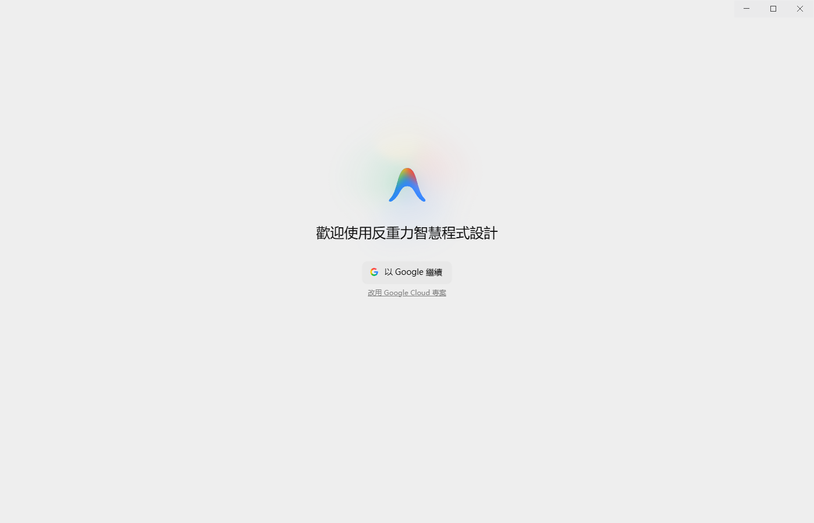
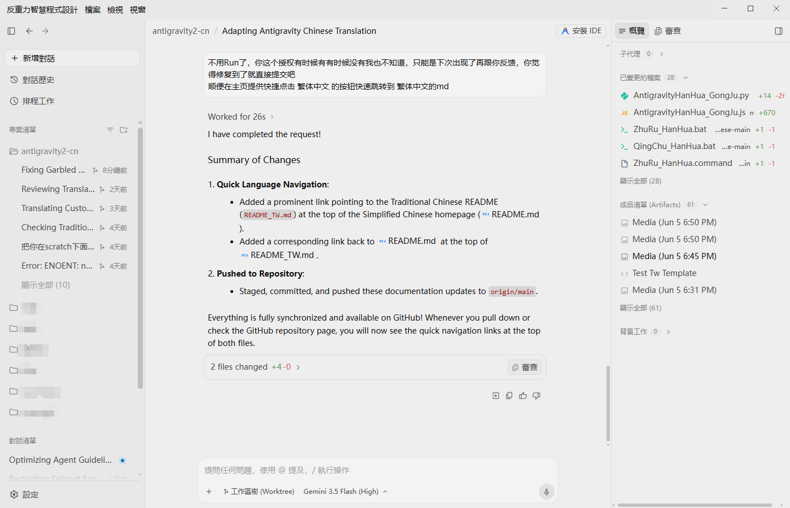
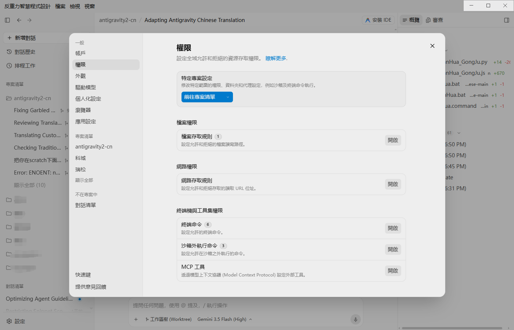

# Antigravity 2.0 智能編程中文語言包 & 繁體中文引擎

👉 **[簡體中文版說明文件 (Simplified Chinese README)](README.md)**

> **支援系統**：Windows & macOS (均已內建一鍵指令碼)  
> **匹配版本**：Antigravity v2.0.11  
> **核心引擎**：Node.js (無需安裝 Python，零依賴，極速極穩)  
> **中文化範圍**：包括軟體介面、頂部系統功能表、工作列右鍵選單、載入動畫、設定面板、新手引導及登入頁。  
> **注入原理**：透過 ASAR 還原與打包，安全注入 `preload.js` 動態翻譯機制，絕不修改核心二進位檔案，一鍵安裝與完美還原。

## 📸 中文化效果展示

以下是部分功能板塊的實際中文化效果展示，涵蓋登入引導頁、主編輯器介面與詳細設定面板：

### 1. 歡迎頁與登入新手引導


### 2. 主編輯器介面與選單


### 3. 詳細參數設定面板


---

## 📂 專案檔案結構
- **`双击安装繁体中文.bat`** / **`.command`**：Windows / macOS 一鍵繁體中文化執行入口。
- **`双击卸载还原官方英文.bat`** / **`.command`**：Windows / macOS 一鍵完美恢復原版入口。
- **`localization_engine.js`**：核心中文化邏輯，負責 app.asar 的解包、程式碼注入、重新打包以及 macOS 下的自動深度重新簽名。
- **`dicts_tw/`**：中文化字典資料夾，內含按模組分類 of JSON 對照翻譯字典。

---

## 🚀 極速使用指南

### 1. 取得中文化包程式碼（二選一）

* **方法 A：直接下載 ZIP 壓縮包（最便捷 📦）**
  1. 點擊頁面右上角綠色的 **`Code`** 按鈕。
  2. 在下拉選單中選擇 **`Download ZIP`** 並下載。
  3. 將下載好的壓縮包**解壓到您電腦本機的任意目錄**（例如您的 `Downloads` 資料夾）。

* **方法 B：透過 Git 命令列複製（開發者推薦 💻）**
  如果您本機安裝了 Git，可以直接在終端機執行複製命令：
  ```bash
  # 如果您在國內，推薦使用下方代理加速複製地址：
  git clone https://mirror.ghproxy.com/https://github.com/qqxpee/antigravity2-cn.git
  
  # 如果您配置了全域代理，可直接使用官方地址：
  git clone https://github.com/qqxpee/antigravity2-cn.git
  ```

---

### 2. 一鍵安裝中文化
1. **完全退出** Antigravity 編程軟體。
2. 進入您解壓或複製出來的 `antigravity2-cn` 資料夾：
   - **Windows**：雙擊執行 **`双击安装繁体中文.bat`**。
   - **macOS**：雙擊執行 **`双击安装繁体中文.command`**。
3. 依提示選擇左上角品牌顯示方式：顯示英文 Antigravity（預設推薦）、不顯示品牌名稱、或顯示繁體中文品牌名。
4. 執行完成後，重新啟動 Antigravity 軟体，即可暢享全繁體中文介面！

### 品牌顯示命令列參數

如果您透過命令列執行 `localization_engine.js`，可使用 `--brand-title` 控制左上角品牌名：

```bash
# 預設推薦：左上角顯示 Antigravity
node localization_engine.js --tw --brand-title english

# 隱藏左上角品牌名
node localization_engine.js --tw --brand-title hidden

# 顯示繁體中文品牌名
node localization_engine.js --tw --brand-title translated
```

---

### 3. 一鍵卸載還原
1. **完全退出** Antigravity 編程軟體。
2. 在當前資料夾下：
   - **Windows**：雙擊執行 **`双击卸载还原官方英文.bat`**。
   - **macOS**：雙擊執行 **`双击卸载还原官方英文.command`**。
3. 執行完成後，軟體將自動清除所有中文化注入，無痕恢復至官方原版英文狀態。

---

## 🛠️ 中文化原理說明

本引擎採用 **ASAR 包注入模式**，專為 **Antigravity 2.0+** 的 Electron 架構量身定制：
1. **自動釋放鎖**：指令碼執行前會自動偵測並安全關閉 Antigravity 執行進程，防止檔案佔用鎖定。
2. **安全備份**：首次執行時，會在軟體目錄自動建立原始 `app.asar.bak` 檔案，確保隨時可無損還原。
3. **精準注入**：
   - 注入 `preload.js`：採用 WeakSet 記錄與 Shadow DOM 穿透，啟動高效的 `MutationObserver` 引擎，動態監測並將渲染層文字翻譯為繁體中文。
   - 注入 `menu.js`：深度補丁系統級標題列選單。
   - 注入 `tray.js`：中文化系統匣與右鍵通知狀態選單。
   - 注入 `loadingOverlay.js`：注入極具極客風格的趣味載入語：「反重力引擎已啟動，正在努力擺脫地心引力...」。

---

## 💡 如何透過 AI 助手自動補充或修改中文化？

如果在使用過程中，您發現了漏譯的英文，或者覺得某些繁體中文翻譯不夠道地，**您可以直接在對話視窗中命令您的 AI 編程助手（即 Antigravity）來幫您更新詞庫**！無論是直接發送螢幕截圖還是描述文字，AI 都會自動幫您把對照詞條寫入詞典。

> [!IMPORTANT]
> **⚠️ AI 助手如何定位您的中文化詞庫檔案？**
> 
> 1. **推薦做法（最省心）**：
>    In Antigravity 軟體中，點擊 **“開啟資料夾 (Open Folder)”**，直接將本中文化包目錄（即包含當前 `README_TW.md` 的資料夾）作為**專案/工作區**開啟，然後在此工作區下與 AI 對話。此時 AI 能夠直接感知並讀寫當前專案，您不需要提供任何路徑，直接發送翻譯要求，AI 就能在背景自動幫您改好詞典！
> 
> 2. **免開專案做法（提示詞中需指定中文化目錄）**：
>    如果您當前正在開發別的專案，沒有把中文化目錄作為專案開啟，那麼您在對 AI 發起中文化命令時，**必須在提示詞裡明確告訴 AI 您的中文化包所在路徑**，否則 AI 無法得知要修改您電腦上的哪個資料夾。
>    * **提示詞範例**：
>      > **“我的中文化包目錄在 `C:\Users\您的電腦使用者名稱\Downloads\antigravity_chinese`（請替換為您本機的實際路徑），請幫我把下面這張截圖裡漏譯的內容補全到詞典裡。”**

### 📋 常用提示詞（Prompt）模板

#### 1. 方式一：直接在對話中傳送截圖（推薦 📸）
如果您不方便打字，可以直接將未中文化乾淨的介面截圖貼上傳送給 AI，並附帶以下指令：
> **“幫我把這張截圖裡所有未中文化的英文選項和面板內容補全到繁體中文詞典中。”**
*(AI 會自動透過視覺識別截圖中的全部英文，並精準寫入字典。)*

#### 2. 方式二：直接在對話中傳送文字描述（極速 ✍️）
如果您只想修改或增加某一個特定詞彙，可以直接傳送文字描述給 AI：
> **“幫我把漏譯的英文 'Allow agent to view and edit files outside of the current workspace automatically' 翻譯為 '允許代理自動檢視並編輯當前工作區之外的檔案'。”**
*(AI 會立即找到對應的詞典並精準修改或追加該詞條。)*

---

### 🔄 更新生效流程
1. **命令 AI 更新**：在對話中透過截圖或文字告訴 AI 您的中文化需求，AI 會自動更新 `dicts_tw/` 下的字典檔案。
2. **退出軟體**：**完全退出**您的 Antigravity 軟體。
3. **重新注入**：在當前資料夾中**再次雙擊執行 `双击安装繁体中文.bat` / `.command`** 重新部署中文化。
4. **重啟軟體**：重新開啟 Antigravity，您的改動即可完美生效！

---

## 📝 詞典自訂指南 (供極客手動使用)

如果您想手動修改翻譯，可以直接開啟 `dicts_tw/` 目錄下的 JSON 檔案：
- **`common.json`**：公共基礎詞彙、側邊栏概覽、登入頁、常用按鈕等。
- **`page_settings.json`**：包含極其豐富的詳細設定面板、權限二級選單對照。
- **`menu_nav.json`**：系統及選單列翻譯。

在 JSON 中新增一行，格式如下即可（注意英文逗號）：
```json
"Original English Text": "您的繁體中文翻譯"
```
儲存後，雙擊執行 **`双击安装繁体中文.bat` / `.command`** 重新部署中文化即可。

---

## 常見問題解答 (FAQ)

### 1）提示「解包失敗」或缺少 npm 環境
* **原因**：中文化引擎依賴 Node.js 進行 ASAR 包的解析。
* **解決**：由於 Antigravity 本身就是一個基於 Node.js/Electron 的程式，您的電腦一般都已自帶環境。如果極少數情況下報錯，只需在電腦安裝 [Node.js](https://nodejs.org/)（LTS 版本即可）並重啟指令碼。

### 2）提示「權限不足」或 macOS 提示「無法開啟」
* **解決**：
  - **Windows**：請右鍵點擊 `双击安装繁体中文.bat`，選擇 **“以系統管理員身分執行”**。
  - **macOS**：若雙擊執行 `.command` 提示無法開啟或沒有執行權限，可在終端機中執行 `chmod +x *.command` 來授權。如果是系統安全攔截，請在「系統設定 -> 隱私權與安全性」中點擊「仍要開啟」。本中文化包已內建自動重新簽名機制，修改後會重新進行 Ad-hoc 簽名以防止 macOS 提示應用程式損壞。

### 3）軟體官方更新後，中文化失效了怎麼辦？
* 軟體升級時，官方會覆蓋 `app.asar` 檔案。您無需擔心，直接完全退出軟體，重新雙擊執行 **`双击安装繁体中文.bat`** 重新注入一次即可完美恢復繁體中文。

---

## 🤝 致謝
感謝所有參與測試與回饋的貢獻者！
